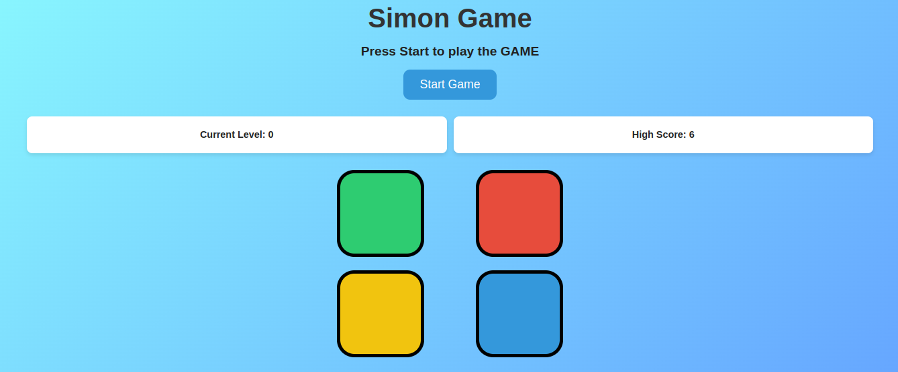
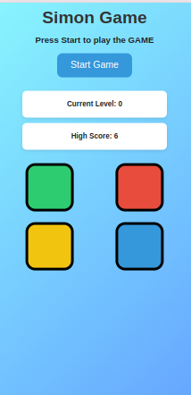

# 🎮 Simon Game

A classic **Simon Game** built with **HTML, CSS, and JavaScript**.  
Test your memory by repeating the color sequences and see how high you can go!  
---

## 🚀 Live Demo
[Click here to play the game](https://saisupriyasuvvada.github.io/Simon-Game/)

---

## 📸 Screenshots

### Desktop View

### Mobile View

---

## ✨ Features
- Responsive 2x2 grid layout (works on desktop & mobile)  
- **Start button** for mobile and **key press** for desktop  
- **Restart button** after Game Over  
- **Current Level** and **High Score** tracking  
- **High Score persists** even after page refresh  
- **Sound effect plays only for the newly added color** in the sequence  
- Smooth flash animations and hover effects  

---

## 🛠️ Technologies Used
- HTML
- CSS
- JavaScript

---

## 📂 Project Setup
No setup required!  
Just open `index.html` in your browser or click the live demo link above.

---

## 📜 License
This project is open-source and free to use.
